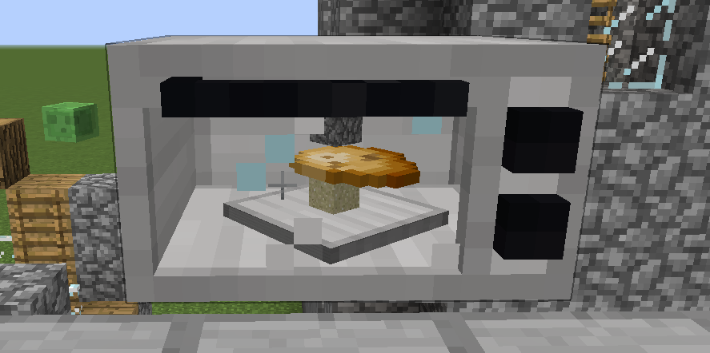

# oven

这个模组里只写了一个烤箱作为参考.

已实现功能

* 烤箱交互界面(ContainerOven GuiContainerOven ModGuiLoader)

* 烤箱使用TileEntity存储物品并使用Itick接口

* 烤箱TESR渲染正在烧制的物品



#使用方法

先下载本项目到本地,运行如下命令
window

```
gradlew.bat -i setupDecompWorkspace
gradlew.bat -i runClient
```

mac、linux

```
gradle -i setupDecompWorkspace
gradle -i runClient
```